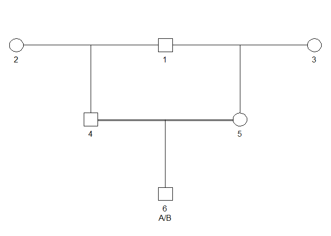

<!-- README.md is generated from README.Rmd. Please edit that file -->
pedtools 
===================================================================

Introduction
------------

The goal of pedtools is to provide a lightweight, but comprehensive tool set for creating, manipulating and visualizing pedigrees with or without marker data. Common pedigree structures are quickly produced with tailor-made functions, while a range of utilities enable modifications like adding or removing individuals, extracting subsets, loop breaking, and merging pedigrees. The plotting functionality is imported from the [kinship2](https://CRAN.R-project.org/package=kinship2) package.

pedtools is a rewritten and improved version of one part of the [paramlink](https://CRAN.R-project.org/package=paramlink) package, which is no longer actively developed. The functionality of paramlink dealing with basic manipulation of pedigrees and markers has been moved to pedtools, in many cases using the same function names. Under the hood, however, many things are changed, including a new S3 class `ped` for basic pedigree objects and many new utility functions.

Installation
------------

To get `pedtools`, install from GitHub as follows:

``` r
 # First install devtools if needed
if(!require(devtools)) install.packages("devtools")

# Install pedtools from github
devtools::install_github("magnusdv/pedtools")
```

Example
-------

We create a pedigree with a consanguineous mating between half siblings. The child has genotype A/B at a SNP marker.

``` r
library(pedtools)

x = halfCousinsPed(0, child = TRUE)
m = marker(x, "6" = c("A", "B"))
plot(x, m, skip.empty.genotypes = TRUE)
```


